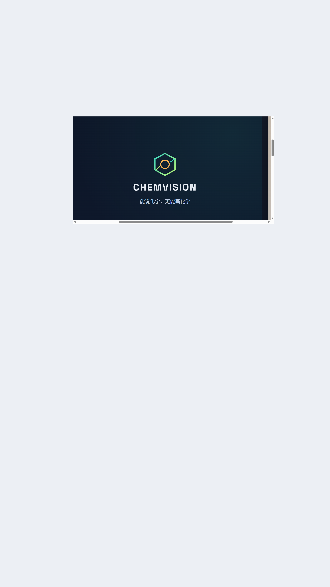
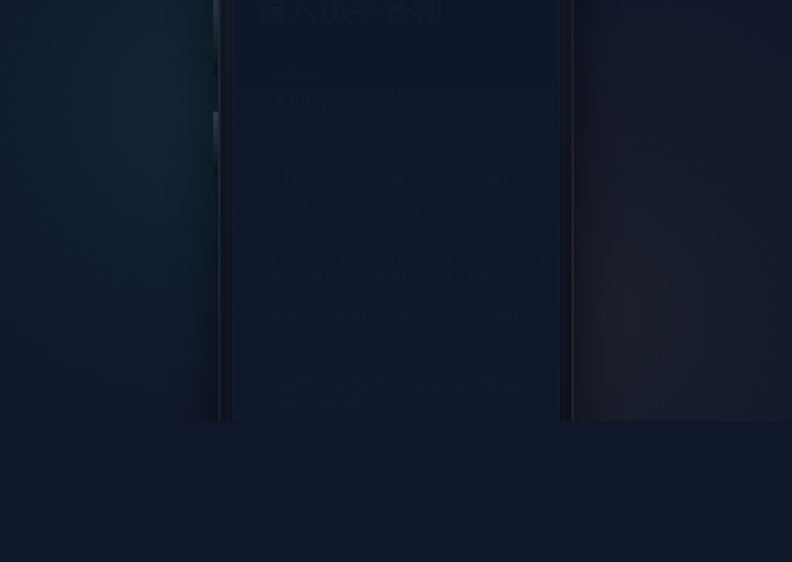
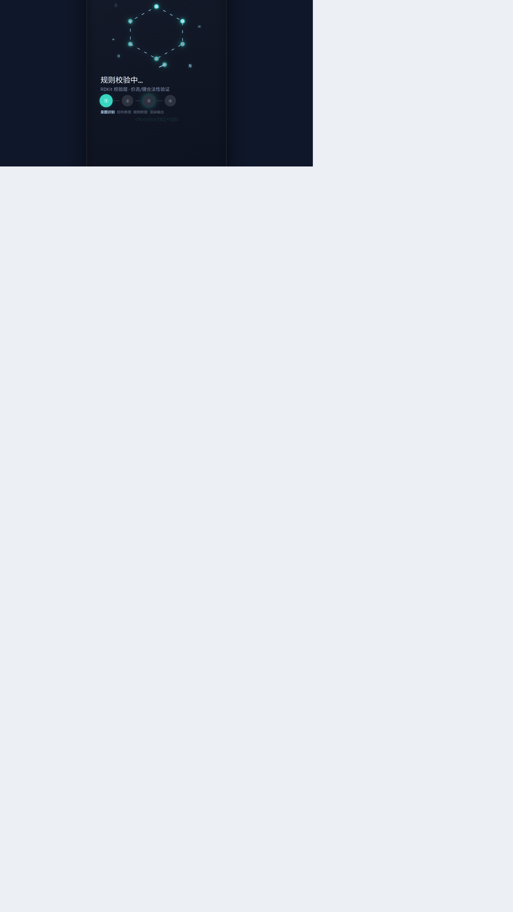
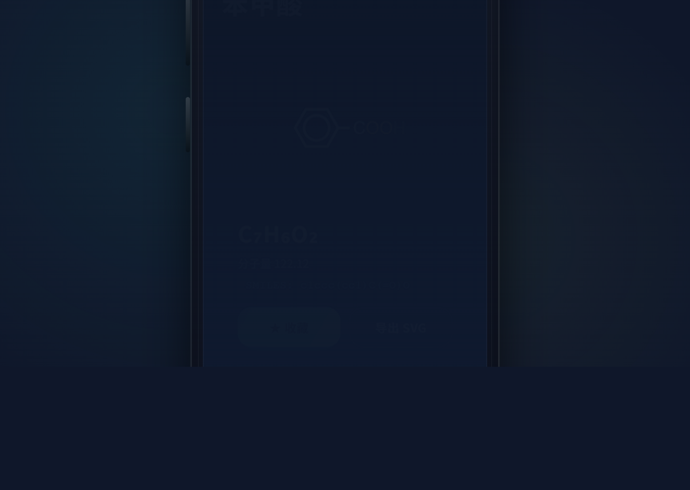
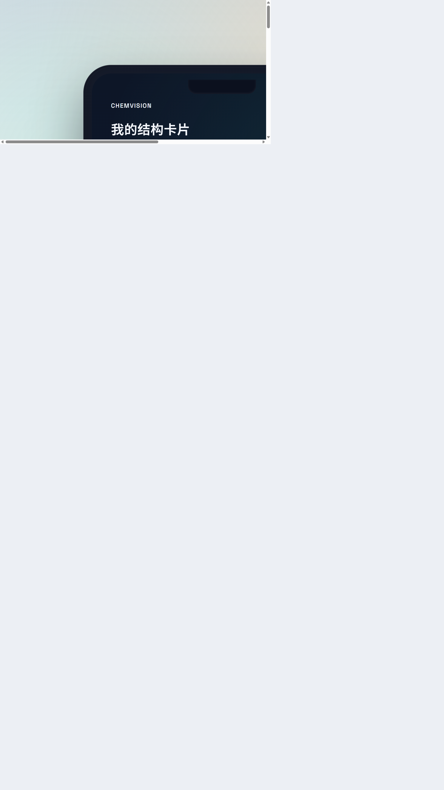

<div align="center">

# ChemVISION

### 化学结构式智能生成、编辑与学习助手


**通用大模型「能说化学，却不能画化学」——ChemVISION 补齐这条裂缝。**

</div>

---

## 核心问题

现有大语言模型在化学领域呈现典型的「能说不能画」缺陷：无法将自然语言描述映射为规范的键线式结构图，SMILES 输出错误率高，且完全缺失中文 IUPAC 命名的专项支持。生成后若存在错误，用户必须切换到 ChemDraw 等专业 PC 端软件才能修正。

**ChemVISION 让大模型「能画化学」，更让用户「能改化学」。**

## 核心功能

| 功能                             | 描述                                                         | 阶段       |
| -------------------------------- | ------------------------------------------------------------ | ---------- |
| **自然语言 → 结构式生成** | 输入化学名称或分子式，自动生成 SVG 键线式结构图              | MVP        |
| **化学规则校验**           | 原子价态、键连接合法性、分子式反向比对，校验不通过自动重生成 | MVP        |
| **反应方程式语义补全**     | 输入不完整反应信息，RAG 增强推断完整方程式及反应条件         | 复赛       |
| **课本印刷体结构识别**     | 拍摄课本结构式，识别转换为可编辑 SMILES                      | 复赛       |
| **残缺结构式智能补全**     | 针对印刷缺失、污损遮挡，分子指纹检索 + LLM 推理补全          | 复赛       |
| **交互式结构编辑器**       | 消除笔、键型修改、原子修改、基团拖拽，编辑后自动校验         | 复赛→决赛 |

## 交互流程

```
用户输入 → 意图识别 → 结构推理 → 规则校验 → 渲染输出 → 卡片收藏
  (端侧)     (端侧)     (云端)      (云端)      (本地)      (本地)
```

以「苯甲酸」为例：

1. **输入** — 键入「苯甲酸」或语音/拍照
2. **意图识别** — 端侧 BlueLM 路由，延迟 <100ms
3. **结构推理** — 云端 BlueLM API 输出 SMILES: `c1ccc(cc1)C(=O)O`
4. **渲染输出** — SVG 键线式图 + 分子式 C₇H₆O₂ + 分子量 122.12
5. **卡片收藏** — 加入错题本，关联知识点

## 界面预览

<div align="center">

|                  启动页                  |                 输入页                 |                  加载动效                  |                  结构卡片                  |                   收藏夹                   |
| :--------------------------------------: | :-------------------------------------: | :-----------------------------------------: | :----------------------------------------: | :-----------------------------------------: |
|  |  |  |  |  |

</div>

## 技术架构

```
┌─────────────────────────────────────────────────────┐
│                    前端应用层                         │
│  vivo Android APP │ SVG/Canvas 双渲染 │ 编辑器交互层  │
├─────────────────────────────────────────────────────┤
│                   端侧组件层                         │
│  BlueLM 意图识别 │ DECIMER OCR │ 结构编辑器引擎      │
├─────────────────────────────────────────────────────┤
│                   云端服务层                         │
│  BlueLM Chat API │ RDKit 校验 │ 向量数据库           │
└─────────────────────────────────────────────────────┘
```

## Web 渲染依赖（本地 assets）

- openchemlib.js v9.22.0 (BSD-3-Clause)
  - 来源: https://cdn.jsdelivr.net/npm/openchemlib@9.22.0/dist/openchemlib.js
- smiles-drawer.js v2.0.1 (MIT)
  - 来源: https://cdn.jsdelivr.net/npm/smiles-drawer@2.0.1/dist/smiles-drawer.js
  - 本地文件已追加 ChemVISION Bridge patch 标记

### 技术栈

| 层级     | 技术                                    |
| -------- | --------------------------------------- |
| AI 底座  | vivo 蓝心大模型（BlueLM）端侧 + 云端    |
| 中间表示 | SMILES（解耦 LLM 推理与渲染）           |
| 规则校验 | RDKit（原子价态、键合法性、分子式验证） |
| 结构渲染 | SmilesDrawer（SVG 键线式图）            |
| 化学 OCR | DECIMER（开源化学结构识别）             |
| 知识检索 | RAG + 分子指纹（Morgan Fingerprint）    |
| 前端原型 | 纯 HTML/CSS/JS，无框架依赖              |

## 项目结构

```
ChemVision/
├── prototype/                  # UI 原型
│   ├── screen-01-splash.html   # 启动页
│   ├── screen-02-input.html    # 输入页
│   ├── screen-03-loading.html  # 加载动效页
│   ├── screen-04-result.html   # 结构卡片结果页
│   ├── screen-05-favorites.html# 收藏与错题本页
│   ├── common.css              # 共享样式
│   └── exports/                # 原型截图导出
├── Project.js                  # 需求说明书 docx 生成脚本
├── 需求说明.md                  # 项目需求说明书（Markdown 源）
├── package.json                # Node.js 依赖配置
└── README.md                   # 本文件
```

## 快速开始

### 查看原型

直接在浏览器中打开 `prototype/` 目录下的 HTML 文件即可预览各页面：

```bash
# 启动页
open prototype/screen-01-splash.html

# 输入页
open prototype/screen-02-input.html

# 加载动效（点击屏幕可手动切换阶段）
open prototype/screen-03-loading.html

# 结构卡片结果页
open prototype/screen-04-result.html

# 收藏与错题本
open prototype/screen-05-favorites.html
```

### 生成需求说明书

```bash
npm install
node Project.js
# 输出: ChemVISION_需求说明书_v3.0.docx
```

## 核心设计决策

### 为什么用 SMILES 作为中间表示？

SMILES 是化学结构的文本表示，解耦了 LLM 推理与图形渲染：

- LLM 只需输出文本，避免直接生成图形的不稳定性
- 规则校验层可对 SMILES 进行原子价态、键合法性验证
- 渲染层可独立优化，支持多种输出格式（SVG / Canvas）

### 规则校验层为什么是核心壁垒？

区别于「纯提示词应用」，ChemVISION 的规则校验层贯穿所有结构输出模块：

| 模块     | 校验内容                      | 触发时机              |
| -------- | ----------------------------- | --------------------- |
| 结构生成 | 原子价态、键连接、分子式比对  | SMILES 生成后、渲染前 |
| 反应补全 | 反应物/生成物合法性、原子守恒 | 候选路径生成后        |
| 残缺补全 | 价态闭合率、拼接边界键合法性  | 候选结构拼接后        |

校验不通过自动重生成（最多 3 次），并展示置信度说明。

### 为什么分阶段交付编辑器？

| 优先级 | 功能                       | 阶段     |
| ------ | -------------------------- | -------- |
| P1     | 消除笔、键型修改、原子修改 | 复赛     |
| P2     | 基团拖拽、撤销/重做        | 决赛     |
| P3     | 可拖动点阵图（力导向微调） | 决赛亮点 |

基础编辑功能确保复赛演示可靠，高级功能作为决赛增量。

## 目标用户

| 用户群体                 | 场景                               |
| ------------------------ | ---------------------------------- |
| 高校化学/化工/药学本科生 | 课程学习、作业预习、命名→结构还原 |
| 有机化学研究生           | 文献阅读、反应路径规划             |
| 高中化学竞赛学生         | 竞赛备考、有机结构式入门           |

核心目标市场规模：**280 万+** 高校化学类在校生 + **60 万** 竞赛备考生。

## 赛事信息

| 项目     | 内容                                         |
| -------- | -------------------------------------------- |
| 竞赛     | 第三届（2026）中国高校计算机大赛 AIGC 创新赛 |
| 赛道     | 应用赛道                                     |
| 技术底座 | vivo 蓝心大模型（BlueLM）                    |
| 承办单位 | 南开大学 × vivo                             |
| 作品形态 | APP / 智能体（vivo 手机原生运行）            |

## 降级预案

云端 API 不可用时，系统自动降级为缓存模式：

- 预缓存 10 个典型分子的完整结构图
- 界面正常展示完整调度流程动效
- 以预缓存结构卡片呈现，保持演示链路完整性

---

## 📱 编译与部署

### 编译 APK

#### 方法 1：使用 Flutter CLI（推荐）

```bash
# 1. 确保 Flutter 在 PATH 中
# 2. 进入项目目录
cd F:\Desktop\ChemVision

# 3. 清理并获取依赖
flutter clean
flutter pub get

# 4. 编译调试版 APK
flutter build apk --debug

# 5. 编译发布版（优化后，体积更小）
flutter build apk --release

# 6. 编译拆分 ABI 版本（推荐，每个 CPU 架构一个文件）
flutter build apk --split-per-abi
```

**输出位置**：

```
build/app/outputs/flutter-apk/
  ├── app-debug.apk                    # 调试版 (~40-60MB)
  ├── app-release.apk                  # 发布版（通用）
  ├── app-armeabi-v7a-release.apk      # 32 位 ARM
  ├── app-arm64-v8a-release.apk        # 64 位 ARM（现代手机）⭐
  └── app-x86_64-release.apk           # x86_64（模拟器）
```

#### 方法 2：使用 Android Studio

1. `File` → `Open` → 选择 `android` 文件夹
2. 等待 Gradle 同步完成
3. `Build` → `Build APK(s)`
4. 点击通知中的 "locate" 查找 APK

#### 方法 3：使用 Gradle 包装器

```bash
cd android
.\gradlew.bat assembleDebug    # 调试版
.\gradlew.bat assembleRelease  # 发布版
```

### 安装到手机

#### USB 调试模式

```bash
# 1. 手机开启开发者选项和 USB 调试
# 2. 连接 USB 线
# 3. 直接运行
flutter run
```

#### ADB 安装

```bash
adb install build/app/outputs/flutter-apk/app-arm64-v8a-release.apk
```

### 常见问题

**找不到 Flutter 命令**：

- 添加 Flutter 到 PATH：`C:\src\flutter\bin`
- 重启终端

**Android SDK 未找到**：

```bash
flutter config --android-sdk "C:\Users\你的用户名\AppData\Local\Android\Sdk"
flutter doctor --android-licenses
```

**Gradle 版本冲突**：

- 检查 `android/gradle/wrapper/gradle-wrapper.properties`
- 使用 Gradle 8.0 或更高版本

---

## 🔍 调试指南

### 模拟运行

#### Android 模拟器

1. Android Studio → Tools → Device Manager
2. Create Device（推荐 Pixel 6 + API 33/34）
3. 启动模拟器
4. `flutter run -d emulator-5554`

#### 真机调试

1. 手机开启开发者选项和 USB 调试
2. USB 连接电脑
3. `flutter run`

### 查看日志

```bash
# Flutter 日志
flutter logs

# ADB 日志
adb logcat

# 过滤应用日志
adb logcat -s flutter
adb logcat --pid=$(adb shell pidof -s com.chemvision.chemvision)

# 忽略 SELinux 警告
adb logcat | grep -v "avc: denied"
```

### 常见问题

#### 主线程卡顿

```
I/Choreographer: Skipped 50 frames!
```

**解决**：已在 `main.dart` 中优化，将耗时操作移到后台异步执行。

#### 录音结束黑屏

**解决**：已在 `asr_provider.dart` 中添加超时保护和错误处理。

#### SELinux 权限拒绝

```
avc: denied { ioctl } for path="/proc/fas/render"
```

**说明**：系统级限制，非致命警告，不影响功能。可忽略或使用过滤器屏蔽。

#### 应用崩溃

```bash
# 查看崩溃日志
adb logcat | grep -E "FATAL|Exception"

# 清除应用数据
adb shell pm clear com.chemvision.chemvision

# 重新安装
flutter clean && flutter run
```

### DevTools 调试

```bash
# 启动 DevTools
flutter pub global run devtools

# 访问 http://127.0.0.1:9100
# 功能：Inspector, Timeline, Memory, Network, Logging
```

---

## License

MIT
